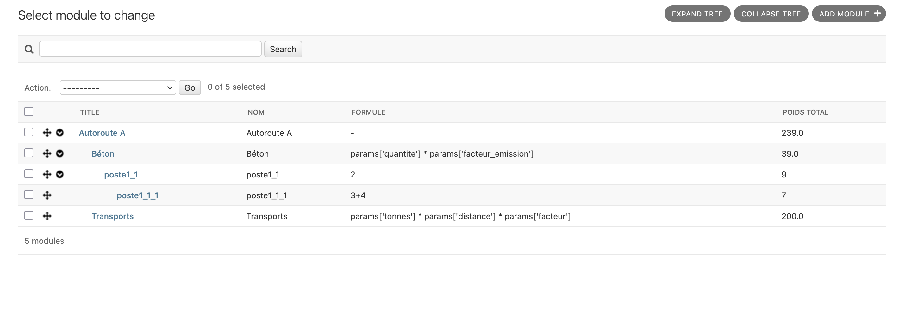

# Intro

Sample app for managaing a hierarchy of modules, each computing a specific value using a dynamic formula, paramaters, and its own sub-modules.

Note: eval is not safe to use in prod, it should be replaced by `asteval` or `numexpr`.

# Next steps

Modules are very simple right now. They could be flagged as templates.
Template could define parent-children links to be mandatory.

Params should be validated.
We could describe them as https://jsonforms.io/docs/ to enable dynamic form.
